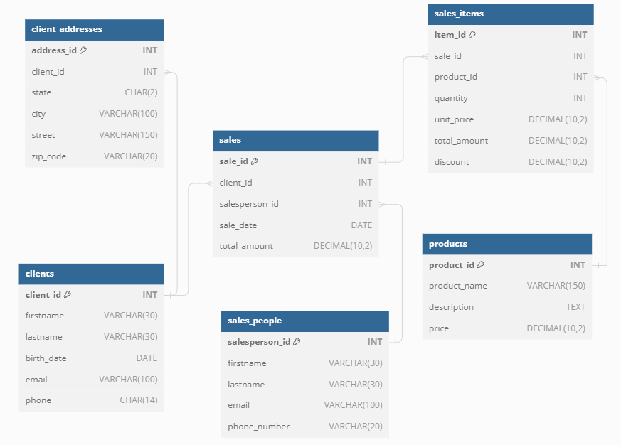
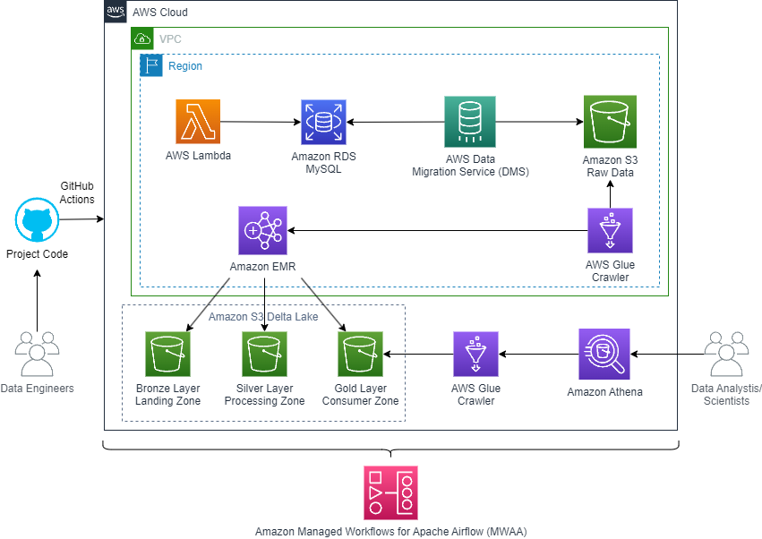

# AWS Data Project Pipeline

## Project Objective

The objective of this project is to create an automated and reusable data engineering pipeline in AWS, involving data creation, extraction, loading, and transformation. This will facilitate the timely availability of clean, transformed data for analytical and business intelligence purposes.

## Project Assumptions 

For the development of the project, the following assumptions were made:

- Use Terraform as the infrastructure as code tool to interact with AWS.

- The data source must be stored on MySQL database.

- The project should be managed by Apache Airflow.

- The technology used for data transformation should be Apache Spark.

- The project should be as simple and reusable as possible.

- The data format in all layers should be Delta, taking advantage of Delta Lake benefits such as ACID transactions.

- The project should have three layers: bronze, silver, and gold.

- Every time there is a change in the Terraform code in the main branch of the repository, the pipeline should be executed.

## Technologies Used in the Project

+ [AWS](hhtp://aws.amazon.com)
    + [S3](https://aws.amazon.com/s3/)
    + [RDS](https://aws.amazon.com/rds/)
    + [VPC](https://aws.amazon.com/vpc/)
    + [EMR](https://aws.amazon.com/emr/)
    + [DMS](https://aws.amazon.com/dms/)
    + [MWAA](https://aws.amazon.com/managed-workflows-for-apache-airflow/)
    + [Lambda](https://aws.amazon.com/lambda/)
    + [Glue](https://aws.amazon.com/glue)
    + [KMS](https://aws.amazon.com/kms/)
    + [Secrets Manager](https://aws.amazon.com/secrets-manager/)
    + [CloudWatch](https://aws.amazon.com/cloudwatch/)
    + [IAM](https://aws.amazon.com/iam/)
    + [Athena](https://aws.amazon.com/athena/)

+ [AWS CLI](https://aws.amazon.com/cli/)
+ [Terraform](https://www.terraform.io/)
    + [AWS Provider](https://registry.terraform.io/providers/hashicorp/aws/latest)
    + [AWS VPC module](https://registry.terraform.io/modules/terraform-aws-modules/vpc/aws/latest)
    + [AWS EC2-VPC Security Group module](https://registry.terraform.io/modules/terraform-aws-modules/security-group/aws/latest)
    + [AWS S3 bucket module](https://registry.terraform.io/modules/terraform-aws-modules/s3-bucket/aws/latest)
    + [AWS DMS module](https://registry.terraform.io/modules/terraform-aws-modules/dms/aws/latest)
    + [AWS Lambda module](https://registry.terraform.io/modules/terraform-aws-modules/lambda/aws/latest)
    + [AWS Secrets Manager module](https://registry.terraform.io/modules/terraform-aws-modules/secrets-manager/aws/latest)
+ [GitHub](http://github.com)
    + [GitHub Actions](https://docs.github.com/en/actions)

## Motivations for Using Each Technology

+ **Terraform** - Infrastructure as code used to create and manage infrastructure on Amazon Web Services (AWS).
+ **Amazon Managed Workflows for Apache Airflow (MWAA)** - Used to orchestrate workflows. MWAA provides scalability and simplifies the management of complex data pipelines.
+ **AWS Lambda** - Provisioning a serverless computing environment with automatic scaling, it was used to execute a Python script that creates and populates five tables (clients, client_addresses, sales_people, sales, sales_items, and products) in Amazon RDS for MySQL.
+ **Amazon Relational Database Service (RDS)** - This resource was used to store the data used in the project.
+ **AWS Database Migration Service (DMS)** - Used to migrate data from RDS MySQL to an S3 bucket, where the Delta Lake will be established. DMS simplifies and accelerates database migrations with minimal downtime.
+ **AWS Glue** - The AWS Glue Data Catalog is used to connect, discover, and write useful metadata for raw and refined data in S3. This enables both EMR and Athena to connect to the data stored in S3.
+ **Amazon S3** - With cost-effective storage classes and easy-to-use management features, Amazon S3 is initially used to store the Terraform state as a backend, enabling version control of files. Later, it serves to establish the Delta Lake for the project.
+ **Amazon EMR** - "EMR simplifies the deployment and scaling of big data frameworks, reducing the complexity of managing clusters. It facilitates the use of big data technologies like Spark and Hive, where Spark plays a central role in transforming Delta Lake layers (Bronze &rarr; Silver &rarr; Gold). Additionally, Hive is utilized for seamless integration with Amazon S3 and the AWS Glue Data Catalog.
+ **AWS Secrets Manager** - Secrets Manager enhances security by managing access to sensitive information through fine-grained policies. It is used to store the Amazon RDS password and each variable required in Amazon MWAA.
+ **AWS Athena** - Analyze data or build applications from an Amazon Simple Storage Service (S3) delta lake.
+ **Git/GitHub** -  To host the source code and files with version control. 
+ **GitHub Actions** - GitHub Actions provides automation for continuous integration and continuous deployment (CI/CD), streamlining development processes and improving collaboration. It maintains the DevOps workflow.

## Instructions for Execution

### Option 1: 
Basically, if you are going to try running the project locally without committing anything, you should set up three variables for the Terraform state S3 backend purposes:

- export AWS_BUCKET_NAME=<>
- export AWS_BUCKET_FILE=<>
- export AWS_DEFAULT_REGION=<>

After that, you just need to:

- Run terraform init
- Run terraform apply

### Option 2: 

On the other hand, it is possible to create or update the project by making a commit to the main branch. GitHub Actions will then execute the Terraform commands. The variables that need to be configured beforehand are listed below: AWS_ACCESS_KEY_ID, AWS_BUCKET_FILE, AWS_BUCKET_NAME, AWS_REGION_NAME and AWS_SECRET_ACCESS_KEY. 

## Configurations

The configuration variables for the project are in the terraform.tfvars file, except for the variables considered sensitive, which are stored in the secrets manager of GitHub Actions.

Variables stored in secrets:

AWS_ACCESS_KEY_ID &rarr; Access Key used to configure the AWS CLI.

AWS_SECRET_ACCESS_KEY &rarr; Secret Access Key used to configure the AWS CLI.

AWS_BUCKET_NAME &rarr; Name of the bucket used to store the Terraform state.

AWS_BUCKET_FILE &rarr; Name of the file used to store the Terraform state.

AWS_REGION_NAME &rarr; AWS region name.

## Project Architectures:

The data source consists of 5 tables, as mentioned previously. The image below illustrates the relationships between these tables in an Amazon RDS MySQL database.

The following is the AWS architecture developed for the project:

The ETL process involves several steps, which are detailed below:

1) Initialization:

    - The project code is developed locally and version-controlled using GitHub. Continuous Integration and Continuous Deployment (CI/CD) are managed with GitHub Actions to automate infrastructure and code changes.
    - Terraform is used to set up the necessary AWS resources consistently and repeatably.

2) Invoking AWS Lambda:

    + An AWS Lambda function is invoked to prepare and initialize data into Amazon RDS MySQL database.

3) Starting DMS Replication:

    + AWS Database Migration Service (DMS) is used to replicate data from an Amazon RDS MySQL database to an Amazon S3 bucket, ensuring the raw data is available for further processing.

4) Cataloging Raw Data with Glue Crawler:

    + An AWS Glue Crawler is triggered to catalog the raw data stored in Amazon S3, updating the Glue Data Catalog to make the raw data available for querying and analysis.

5) Processing Data with EMR:

    + An Amazon EMR cluster is created to process the raw data. The cluster runs Spark jobs to transform the data through different stages:
        + Bronze Layer (Landing Zone): Raw data is initially stored.
        + Silver Layer (Processing Zone): Data is cleaned and enriched.
        + Gold Layer (Consumer Zone): Final refined data is stored, ready for analysis.
    
6) Cataloging Processed Data with Glue Crawler:

    - Another AWS Glue Crawler is triggered to catalog the refined data in the Gold layer, updating the Glue Data Catalog to make the processed data available for querying.

8) Completion:

    - The workflow concludes with a final step, marking the end of the ETL process and ensuring all tasks are successfully completed.

This ETL workflow leverages AWS services like Lambda, DMS, Glue, and EMR to ensure efficient data processing and management. GitHub Actions facilitate CI/CD for the project code, while data analysts and scientists can easily query the processed data using Amazon Athena.

## Possible Project Enhancements

+ Integrate additional data quality checks and validations at various stages of the ETL pipeline to ensure data accuracy and consistency;
+ Implement data lineage tracking and enhanced monitoring to provide better visibility into the data flow and transformations, aiding in debugging and compliance;
+ Separate dev, staging, and prod environments using Terraform workspace or Terraform grunt for creation and management of these environments.